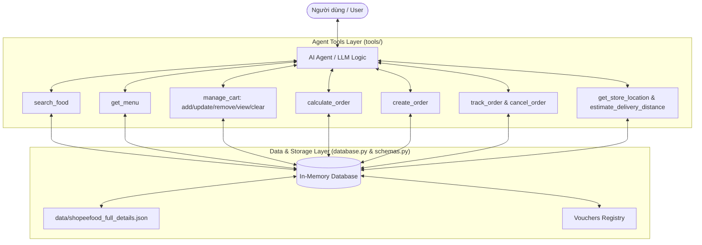

# Kiến trúc Hệ thống Food Ordering AI Agent

Tài liệu này tổng hợp toàn bộ kiến trúc hệ thống, sơ đồ các luồng xử lý, bộ dữ liệu, cũng như chi tiết các phương thức (methods) và công cụ (tools) của dự án **Trợ lý AI Đặt đồ ăn & Tư vấn Thực đơn**.

> **Lưu ý về nguồn dữ liệu:** Hệ thống sử dụng tập dữ liệu duy nhất từ file [shopeefood_full_details.json](file:///d:/download/Tai_lieu_Vin_AI/Batch03-Nhom-A9/project/codebase/data/shopeefood_full_details.json) (chứa đầy đủ thông tin nhà hàng, danh mục, danh sách món ăn, giá bán và mô tả từ ShopeeFood). Không sử dụng các tập dữ liệu cũ.

---

## 1. Tổng quan Kiến trúc (System Overview)

Hệ thống được thiết kế theo mô hình **Agentic Tool-Calling Architecture** cho phép LLM / AI Agent tương tác trực tiếp với cơ sở dữ liệu In-Memory được khởi tạo duy nhất từ file dữ liệu thực tế ShopeeFood.



---

## 2. Các Thành phần Chính (Core Components)

### 2.1. Nguồn Dữ liệu Duy nhất (Single Source of Truth)
File chính: [shopeefood_full_details.json](file:///d:/download/Tai_lieu_Vin_AI/Batch03-Nhom-A9/project/codebase/data/shopeefood_full_details.json)

Chứa dữ liệu chi tiết của hệ thống ShopeeFood gồm các trường thông tin:
* `name`: Tên quán ăn / nhà hàng (ví dụ: *Mì Trộn Indomie Vinhome Ocean Park*).
* `address`: Địa chỉ chi tiết quán ăn (dùng cho tra cứu vị trí & tính khoảng cách giao hàng).
* `rating` & `total_review`: Đánh giá và số lượt review.
* `url`: Đường dẫn trang ShopeeFood chính thức.
* `menu`: Danh sách các danh mục món ăn (`category`), chứa chi tiết các món (`dishes`: `dish_name`, `price`, `description`, `is_available`).

---

### 2.2. Lớp Mô hình Dữ liệu (Schemas Layer)
File chính: [schemas.py](file:///d:/download/Tai_lieu_Vin_AI/Batch03-Nhom-A9/project/codebase/schemas.py)

Sử dụng **Pydantic** để chuẩn hóa dữ liệu từ `shopeefood_full_details.json` thành các đối tượng Python:
* `MenuItem`: Quản lý thông tin từng món ăn (mã món `id`, `name`, `category`, `price`, `description`, `is_vegetarian`, `is_spicy`, danh sách dị ứng `allergens`, trạng thái `is_available`).
* `CartItem` & `Cart`: Quản lý giỏ hàng theo phiên (`session_id`), tính toán giá trị tạm tính `subtotal`.
* `Voucher`: Mã giảm giá (% giảm, giảm tối đa, yêu cầu giá trị đơn tối thiểu).
* `CustomerInfo`: Thông tin người nhận (họ tên, SĐT, địa chỉ, phương thức thanh toán `COD`, `MOMO`, `ZALOPAY`, `BANK_TRANSFER`).
* `Order`: Đơn hàng chính thức (mã đơn `order_id`, danh sách món, tổng tiền, phí ship, giảm giá, trạng thái đơn `PENDING`, `PREPARING`, `DELIVERING`, `COMPLETED`, `CANCELLED`).
* `RestaurantBranch` & `RestaurantInfo`: Thông tin nhà hàng & chi nhánh (tên quán, địa chỉ, tọa độ `lat/lon`, Google Maps URL, hotline, giờ mở cửa) trích xuất từ dữ liệu ShopeeFood.

---

### 2.3. Lớp Quản lý Dữ liệu In-Memory (Data Manager)
File chính: [database.py](file:///d:/download/Tai_lieu_Vin_AI/Batch03-Nhom-A9/project/codebase/database.py)

Đảm nhận việc đọc, trích xuất và lưu trữ dữ liệu từ [shopeefood_full_details.json](file:///d:/download/Tai_lieu_Vin_AI/Batch03-Nhom-A9/project/codebase/data/shopeefood_full_details.json) vào bộ nhớ In-Memory:
* `load_menu()`: Parse và nạp danh sách các món ăn trong file ShopeeFood vào `MENU_DB`.
* `load_restaurant_info()`: Parse thông tin nhà hàng và địa chỉ chi nhánh từ file ShopeeFood vào `RESTAURANT_INFO_CACHE`.
* `CARTS_DB`: Bộ lưu trữ giỏ hàng người dùng phân theo `session_id`.
* `ORDERS_DB`: Bộ lưu trữ các đơn hàng đã chốt thành công.
* `VOUCHERS_DB`: Bộ lưu trữ mã giảm giá mẫu (`BATCH03`, `HELLOGROUP9`, `FREESHIP`).

---

### 2.4. Lớp Công cụ Agent (Agent Tools Layer)
Thư mục: [tools/](file:///d:/download/Tai_lieu_Vin_AI/Batch03-Nhom-A9/project/codebase/tools/__init__.py)

Tất cả các công cụ đều trả về kiểu `Dict` chứa trạng thái `status` (`success`, `warning`, `error`) kèm dữ liệu đã được định dạng chuẩn:

| Module File | Hàm Công cụ (Function) | Mô tả Chức năng |
|---|---|---|
| [search_food.py](file:///d:/download/Tai_lieu_Vin_AI/Batch03-Nhom-A9/project/codebase/tools/search_food.py) | `search_food()` | Tìm kiếm món ăn trong dữ liệu ShopeeFood theo từ khóa tên/mô tả, lọc giá tối đa, ăn chay, độ cay. |
| [get_menu.py](file:///d:/download/Tai_lieu_Vin_AI/Batch03-Nhom-A9/project/codebase/tools/get_menu.py) | `get_menu()` | Trả về thực đơn đầy đủ hoặc lọc theo từng danh mục món ăn (Category) trong file ShopeeFood. |
| [manage_cart.py](file:///d:/download/Tai_lieu_Vin_AI/Batch03-Nhom-A9/project/codebase/tools/manage_cart.py) | `add_to_cart()` | Thêm món vào giỏ hàng với số lượng và ghi chú riêng (ví dụ: *"Ít cay"*, *"Không hành"*). |
| | `update_cart()` | Cập nhật số lượng/ghi chú món ăn trong giỏ (tự xóa món khi `quantity <= 0`). |
| | `remove_from_cart()` | Xóa một món ăn ra khỏi giỏ hàng. |
| | `view_cart()` | Trả về thông tin chi tiết và tạm tính của giỏ hàng hiện tại. |
| | `clear_cart()` | Làm sạch toàn bộ giỏ hàng của phiên làm việc. |
| [calculate_order.py](file:///d:/download/Tai_lieu_Vin_AI/Batch03-Nhom-A9/project/codebase/tools/calculate_order.py) | `calculate_order()` | Bảng tính chi phí: tiền món ăn, phí giao hàng, voucher giảm giá & tổng tiền thanh toán. |
| [create_order.py](file:///d:/download/Tai_lieu_Vin_AI/Batch03-Nhom-A9/project/codebase/tools/create_order.py) | `create_order()` | Validate SĐT/địa chỉ, chốt đơn hàng `ORD-XXXXX`, lưu đơn và xóa giỏ. |
| [track_order.py](file:///d:/download/Tai_lieu_Vin_AI/Batch03-Nhom-A9/project/codebase/tools/track_order.py) | `track_order()` | Tra cứu trạng thái đơn hàng (đang làm/đang giao/hoàn thành/đã hủy). |
| | `cancel_order()` | Xử lý yêu cầu hủy đơn (chỉ cho phép khi ở trạng thái PENDING/PREPARING). |
| [get_store_location.py](file:///d:/download/Tai_lieu_Vin_AI/Batch03-Nhom-A9/project/codebase/tools/get_store_location.py) | `get_store_location()` | Trích xuất địa chỉ quán từ file ShopeeFood, giờ mở cửa & link Google Maps. |
| | `estimate_delivery_distance()` | Tính khoảng cách giao hàng từ địa chỉ quán ShopeeFood đến khách, tính phí ship & link đường đi. |

---

## 3. Các Luồng Xử lý Chính (Data & Action Flows)

### 3.1. Luồng Tìm kiếm & Tra cứu Thực đơn ShopeeFood
```
User Request -> Agent -> get_menu() / search_food() -> Trích xuất từ shopeefood_full_details.json -> Trả kết quả cho Agent
```

### 3.2. Luồng Quản lý Giỏ hàng & Tính tiền
```
User Chọn món -> Agent -> add_to_cart() / update_cart() -> Cập nhật CARTS_DB
User Hỏi tổng tiền -> Agent -> calculate_order() -> Tính subtotal + shipping_fee - discount -> Trả kết quả
```

### 3.3. Luồng Đặt hàng (Create Order)
```
User Chốt đơn -> Agent -> create_order()
                 ├── Validate CustomerInfo (Tên, SĐT 10 số, Địa chỉ, PTTT)
                 ├── Tính toán tổng chi phí (calculate_totals)
                 ├── Tạo mã đơn (ORD-XXXXX) & Lưu vào ORDERS_DB
                 └── Xóa giỏ hàng (clear_cart)
```

### 3.4. Luồng Tra cứu & Hủy đơn hàng (Track & Cancel Order)
```
User Tra cứu đơn -> Agent -> track_order(order_id) -> Truy vấn ORDERS_DB -> Trả về trạng thái
User Yêu cầu hủy -> Agent -> cancel_order(order_id)
                 ├── Nếu status in [PENDING, PREPARING] -> Đổi status thành CANCELLED (Thành công)
                 └── Nếu status in [DELIVERING, COMPLETED] -> Từ chối hủy (Trả lỗi)
```

---

## 4. Bộ Kiểm thử (Unit Testing)

Tất cả các công cụ được kiểm thử tự động tại [test_tools.py](file:///d:/download/Tai_lieu_Vin_AI/Batch03-Nhom-A9/project/codebase/tests/test_tools.py) bao gồm 5 kịch bản chính:
1. `test_get_menu`: Lấy thực đơn tổng và theo category từ dữ liệu ShopeeFood.
2. `test_search_food`: Tìm kiếm món ăn theo từ khóa và lọc chay/mặn/cay.
3. `test_manage_cart_flow`: Luồng thêm, cập nhật, xóa món và xem giỏ hàng.
4. `test_calculate_and_create_order`: Luồng tính tiền, áp mã voucher, tạo đơn hàng, xóa giỏ, tra cứu và hủy đơn.
5. `test_store_location_and_distance`: Tra cứu địa chỉ nhà hàng ShopeeFood và ước tính khoảng cách giao hàng.

Lệnh thực thi test:
```powershell
.\.venv\Scripts\python.exe -m unittest discover -s project/codebase/tests
```
